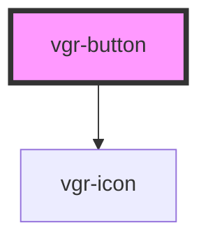

# my-component

<!-- Auto Generated Below -->

## Properties

| Property   | Attribute  | Description | Type                              | Default     |
| ---------- | ---------- | ----------- | --------------------------------- | ----------- |
| `disabled` | `disabled` |             | `boolean`                         | `false`     |
| `icon`     | `icon`     |             | `string`                          | `undefined` |
| `text`     | `text`     |             | `string`                          | `undefined` |
| `type`     | `type`     |             | `"button" \| "reset" \| "submit"` | `'button'`  |
| `variant`  | `variant`  |             | `"primary" \| "secondary"`        | `'primary'` |

## Events

| Event      | Description | Type                |
| ---------- | ----------- | ------------------- |
| `vgrClick` |             | `CustomEvent<void>` |

## Dependencies

### Depends on

- [vgr-icon](../vgr-icon)

### Graph

----------------------------------------------

*Built with [StencilJS](https://stenciljs.com/)*
