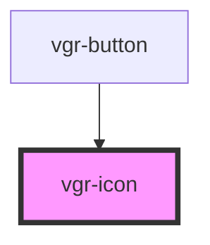

# vgr-icon

<!-- Auto Generated Below -->

## Properties

| Property            | Attribute | Description                                                                                                               | Type     | Default     |
| ------------------- | --------- | ------------------------------------------------------------------------------------------------------------------------- | -------- | ----------- |
| `icon` _(required)_ | `icon`    | SVG markup for the icon. Must come from our own icon package, never from user input, since it is rendered with innerHTML. | `string` | `undefined` |

## Dependencies

### Used by

 - [vgr-button](../vgr-button)

### Graph

----------------------------------------------

*Built with [StencilJS](https://stenciljs.com/)*
